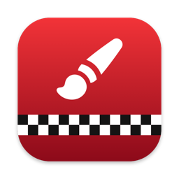
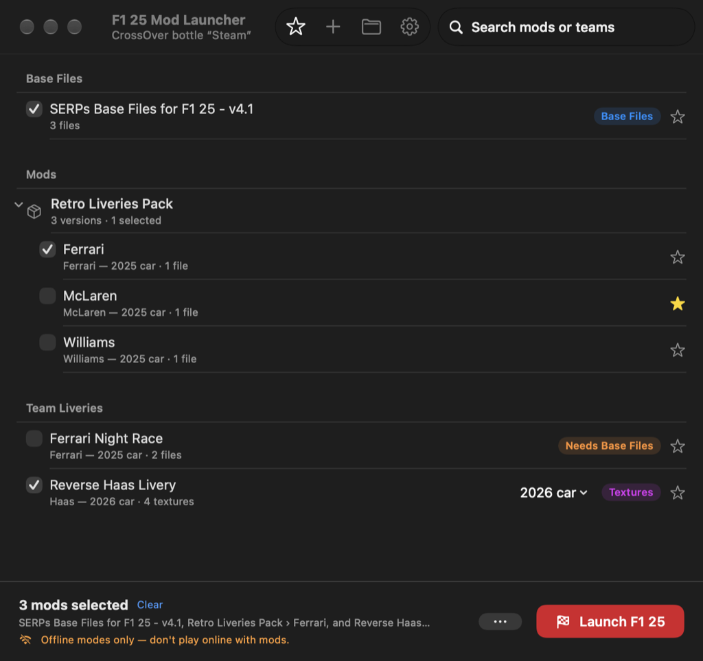
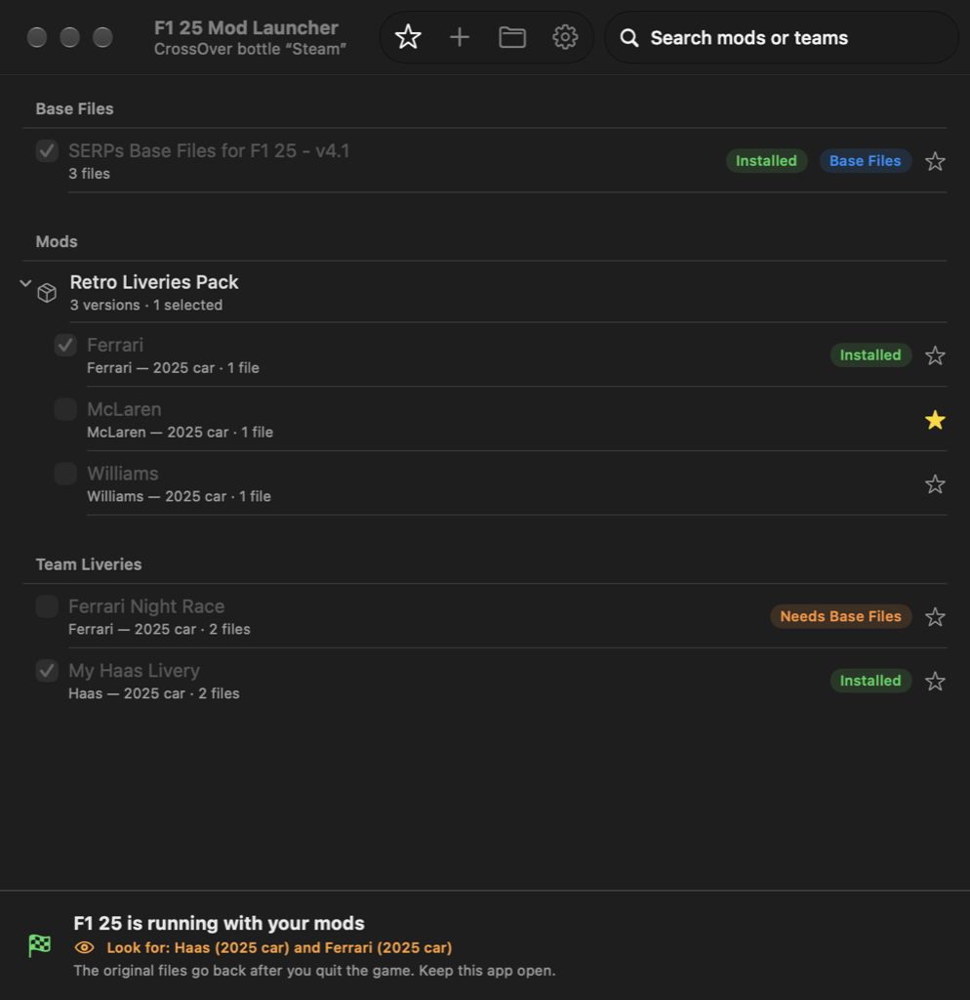
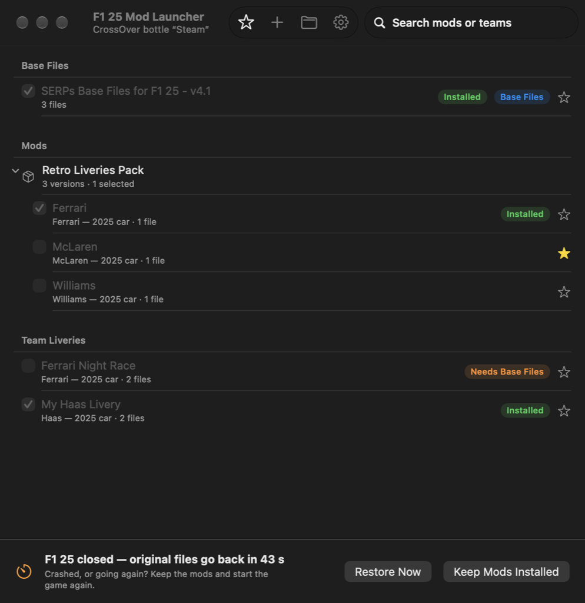

<p align="center">
  
</p>

<h1 align="center">F1 25 Mod Launcher for Mac</h1>

<p align="center">
  <b>Custom liveries in F1 25 on your Mac through CrossOver: drag in a mod, tick it, press Launch.</b><br>
  A native macOS version of <i>SERPs Launcher for F1 25</i> by Team Simplified.
</p>

<p align="center">
  
  
  
  
</p>

<p align="center">
  <a href="../../releases/latest"><b>⬇️ Download the latest version</b></a>
</p>

<p align="center">
  
</p>

---

## Why this exists

On Windows, F1 25 livery mods are installed with **SERPs Launcher**. It copies the mod into the game, starts F1 25, and puts the original files back when you quit. That launcher is Windows-only, and it doesn't know about CrossOver bottles.

**F1 25 Mod Launcher for Mac** does the same job natively on macOS. It finds F1 25 inside your CrossOver bottle, installs the mods you pick, starts the game through Steam in the bottle, and restores the original files when you're done. It works with the same mod files people already share for SERPs Launcher.

## Features

- 🎨 **Works with SERPs-style mods**: `.zip`, `.rar` and `.7z`, straight from the download. Nothing extra to install.
- 🖼️ **Texture mods (`.dds`)**: mods that are just texture images named like the game's (e.g. `haas_paint_d.tif.dds`) are packed into the right game `.erp` file for you. Uncompressed images are compressed to the game's own format.
- 🎯 **Picks the right car**: it compares a texture mod with the 2024/2025/2026 cars and uses the closest match. You can change it from the row's menu.
- 📂 **No `2025_asset_groups` folder needed**: loose game files are matched to the game file with the same name.
- 🧩 **Your own liveries too**: drag in a *folder* with your files (`.dds` textures, or files laid out like the game) and it's packed into a mod for you.
- 🚫 **Tells you when a download isn't for F1 25**, e.g. Assetto Corsa skins.
- 🏎️ **Shows which car a mod changes**, e.g. *"Haas — 2025 car"*. F1 25 has separate 2025 and 2026 cars, so you know where to look. This works even for liveries packed inside shader files.
- 📦 **Packs with versions**: an archive with one folder per team shows each version separately.
- ⚔️ **Conflict protection**: turning on a mod turns off any other mod that changes the same game files.
- 🧱 **SERPs Base Files handled for you**: mods that need them are marked, and the Base Files switch on automatically.
- ▶️ **One-click launch** through Steam in your CrossOver bottle, the same as pressing Play.
- ♻️ **Your game stays clean**: only the files a mod replaces are set aside, and they go back after you quit. Files the mod *added* are removed too.
- 🛟 **Built for CrossOver**: F1 25 sometimes restarts itself or crashes under CrossOver. After the game closes, a 45-second countdown lets you relaunch with your mods still in place.
- 💾 **Crash-safe**: if the launcher or your Mac quits mid-session, the originals are restored the next time you open it.
- ⭐ Favorites, search, and categories (just folders).
- 📝 **Activity log**: every installed file, the launch command, and game start/stop, for easy troubleshooting.

<p align="center">
  
</p>

## Requirements

- A Mac with **macOS 14 Sonoma or newer** (Apple Silicon or Intel)
- **F1 25 installed through Steam in a CrossOver bottle.** See [Getting F1 25 running in CrossOver](#getting-f1-25-running-in-crossover) below.
- Mods made for SERPs Launcher, and usually the free **[SERPs Base Files for F1 25](https://www.overtake.gg/downloads/serps-base-files-for-f1-25-simplified-erps-serps-use-to-play-f1-25-with-serps-compatible-mods.77448/)**

## Getting F1 25 running in CrossOver

Set this up once, before using the launcher. "The F1 25 folder" means the game's folder inside your bottle: `…/drive_c/Program Files (x86)/Steam/steamapps/common/F1 25`.

1. **Anti-cheat**

   - Download Reshade bypass for F1 25 from OverTake: [https://www.overtake.gg/downloads//](https://www.overtake.gg/downloads/reshade-bypass-for-f1-25.78274/)
   - Extract the archive then run bypass.exe, you will then have 2 files bypass.exe and EAAntiCheat.GameServiceLauncher.exe
   - Go the the F1 25 game directory in your steam files and paste these two files there and when it prompts you to replace them click replace

2. **Stop the videos from freezing the game.** In the F1 25 folder, rename the `videos` folder to `videos_backup`.
3. **Steam settings.**
   - Open CrossOver and start Steam.
   - In Steam's top menu, choose **Steam ▸ Go Offline**.
   - Right-click **F1 25** in your library, choose **Properties**, and enter this in **Launch Options**:
     ```
     -nomoviestartup -windowed
     ```
4. **Turn off ray tracing.**
   - In Finder, open `drive_c/users/crossover/Documents/My Games/F1 25/hardware_settings/` in your bottle.
   - Open `hardware_settings_config.xml` in TextEdit.
   - Set each of these to `false`: `rt_shadows`, `rt_reflections`, `rt_transparent_reflections`, `rt_ao`, `rt_ddgi`, `rt_pathtrace`, `rt_ray_reconstruction`.
   - Save and close the file.
5. **Clear stuck shader compiles.** Open Terminal and run:
   ```bash
   killall -9 MTLCompilerService
   ```
6. **Launch.**
   - Turn off Wi-Fi on your Mac, so the game doesn't hang trying to reach EA's servers.
   - Start F1 25, either through Steam in CrossOver or with **Launch F1 25** in the launcher.
   - If a network prompt appears, press **Return** to continue to the main menu.

## Install

1. Download **`F1-25-Mod-Launcher-mac.zip`** from the [latest release](../../releases/latest) and double-click it to unzip.
2. Drag **F1 25 Mod Launcher** into your **Applications** folder.
3. **First launch only:** the app isn't from the App Store, so macOS blocks it the first time.
   - Double-click the app, and click **Done** on the warning.
   - Open **System Settings ▸ Privacy & Security**, scroll down, and click **Open Anyway** next to "F1 25 Mod Launcher".
   - Confirm with **Open Anyway** (and your password if asked). After that it opens normally.

   <details>
   <summary>Or, from Terminal</summary>

   ```bash
   xattr -dr com.apple.quarantine "/Applications/F1 25 Mod Launcher.app"
   ```
   </details>

## How to use it

1. **Open the launcher.** It finds F1 25 in your CrossOver bottles by itself. The title bar shows the bottle, e.g. *CrossOver bottle "Steam"*.
2. **Add mods.** Drag the downloaded `.zip` / `.rar` / `.7z` files onto the window, or click **+**. Add the **SERPs Base Files** zip too.
3. **Tick what you want.** Each row tells you which car it changes (*"Ferrari — 2025 car"*).
4. Click **Launch F1 25**. The mods are installed and checked, then Steam in your bottle starts the game.
5. **Drive the right car.** The bottom bar shows *"Look for: …"*. A livery for the **2025** car only shows on the 2025 car, not the 2026 one.
6. **Quit the game when you're done.** After a 45-second countdown the original files go back. Keep the launcher open while you play.

The **•••** button next to Launch installs mods *without* starting the game, if you'd rather press Play in CrossOver yourself.

<p align="center">
  
</p>

### Your own livery

Put your files in a folder laid out like the game, for example:

```
My Livery/
└── 2025_asset_groups/
    └── f1_2025_vehicle_package/
        └── teams/
            └── haas/
                └── …your .erp files
```

Drag the **My Livery** folder onto the launcher. It's packed into a zip in your mods folder and works like any other mod.

### Categories

Categories are folders inside the mods folder (toolbar ▸ 📁). Make a folder in Finder, or right-click a mod ▸ **Move to Category ▸ New Category…**.

## How it keeps your game clean

| When | What happens |
| --- | --- |
| You press **Launch** | Each game file a mod replaces is moved aside, and the mod's file is put in its place. For texture mods, a copy of the game's `.erp` is made with the new textures inside. Every file is checked after copying. |
| F1 25 is running | Nothing more is touched. The launcher only watches whether the game is still running. |
| F1 25 closes | A 45-second countdown starts. If the game starts again (a restart or a crash), the mods stay in place. |
| Countdown ends / **Restore Now** | The original files go back, and files and folders the mods added are removed. |
| Steam updated a file in the meantime | The update is kept rather than overwritten with an out-of-date backup. |
| The launcher or your Mac quit mid-session | The originals are restored next time you open the launcher. |

Nothing touches the game's `.exe` or any anti-cheat files.

> ⚠️ **Offline modes only.** Don't play online while mods are installed.

## Troubleshooting

<details>
<summary><b>The mod is installed but I don't see it in the game</b></summary>

- Check which car the mod changes: it's shown on the mod's row and in the *Look for* line while you play. F1 25 has **separate 2025 and 2026 cars**, and a mod for one doesn't change the other. For texture mods, use the row's **2026 car ▾** menu to switch cars, or pick **All Cars**.
- Make sure the **SERPs Base Files** are ticked if the mod says *Needs Base Files*.
- Check that the mod supports your game version and Base Files version. The mod's download page usually says.
</details>

<details>
<summary><b>"Couldn't start F1 25 automatically"</b></summary>

Your mods are still installed. Press **Play** on F1 25 in Steam inside CrossOver, and the launcher will notice the game starting. The message includes CrossOver's error. **Help ▸ Show Activity Log** has the full details.
</details>

<details>
<summary><b>The launcher didn't find my game</b></summary>

Open **Settings** (⌘,) ▸ **Choose…** and select the `F1 25` folder inside your bottle:
`~/Library/Application Support/CrossOver/Bottles/<bottle>/drive_c/Program Files (x86)/Steam/steamapps/common/F1 25`
(In the file picker, press ⌘⇧. to show hidden folders like Library.)
</details>

<details>
<summary><b>Something looks wrong with the game files</b></summary>

Press **Restore Original Files** in the launcher. If that doesn't fix it, in Steam go to **F1 25 ▸ Properties ▸ Installed Files ▸ Verify integrity of game files**. That always brings the game back to stock.
</details>

<details>
<summary><b>Does it work with Whisky / other Wine setups?</b></summary>

The launcher looks for CrossOver bottles and uses CrossOver to start the game. With other Wine setups, choose the game folder in Settings, use **••• ▸ Install Mods Without Starting the Game**, and start F1 25 yourself. The originals still come back when the game closes.
</details>

Help ▸ **Show Activity Log** lists everything the launcher did: every file it installed (with its size), the exact command used to start the game, when the game started and stopped, and what was restored. Please include it when you report a problem.

## Where things are stored

| What | Where |
| --- | --- |
| Your mods (sub-folders = categories) | `~/Library/Application Support/F1 25 Mod Launcher/Mods` |
| Original game files while mods are active | `~/Library/Application Support/F1 25 Mod Launcher/Backups` |
| Activity log | `~/Library/Application Support/F1 25 Mod Launcher/activity.log` |

## Build it yourself

Needs Xcode or the Xcode Command Line Tools.

```bash
git clone https://github.com/zeyadm3/F1-25-Mod-Launcher-Mac.git
cd F1-25-Mod-Launcher-Mac
./build.sh              # builds "build/F1 25 Mod Launcher.app" (Apple Silicon + Intel)
./build.sh test         # runs the engine tests against a throw-away fake game folder
```

| File | What it does |
| --- | --- |
| `Sources/Core.swift` | Reading mods, installing and restoring, CrossOver, settings |
| `Sources/GameIndex.swift` | Knows where every game file and texture lives (cached) |
| `Sources/ERP.swift` | Reads and writes the game's `.erp` archives |
| `Sources/Zstd.swift` | A small zstd decoder/writer, since `.erp` pieces are zstd-compressed |
| `Sources/Textures.swift` | `.dds` reading, BC1–BC5 compression, putting textures into `.erp` files |
| `Sources/App.swift` | The SwiftUI interface |
| `Sources/DebugHarness.swift` | Debug builds only: drives the UI for testing |

Archives are read with macOS's built-in `bsdtar`, so there are no dependencies.

## Credits

- **SERPs Launcher for F1 25** and the **[SERPs Base Files](https://www.overtake.gg/downloads/serps-base-files-for-f1-25-simplified-erps-serps-use-to-play-f1-25-with-serps-compatible-mods.77448/)** by **Team Simplified**. This app is a macOS port of their launcher's mod handling (MIT License).
- Livery mods belong to their authors. Download them from the original pages and support the creators.

## License & disclaimer

[MIT](LICENSE). Includes the original SERPs Launcher copyright notice.

This is an unofficial fan project. It isn't affiliated with or endorsed by EA, Codemasters, Formula 1, Team Simplified, or CodeWeavers. F1 25 is a trademark of its respective owners. Mods change game files: use them at your own risk, and in offline modes only.
